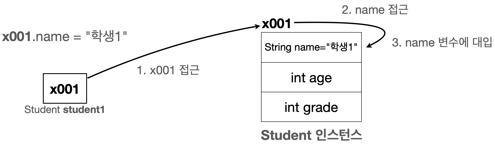
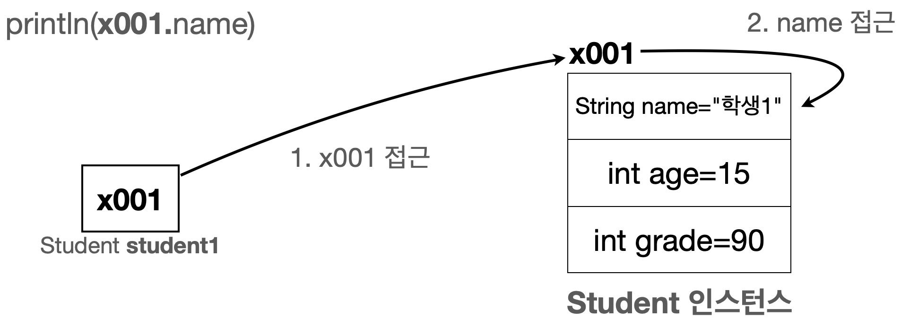

# 객체 사용

클래스를 통해 생성한 **객체를 실제로 사용**하려면,
먼저 **메모리에 존재하는 객체에 접근**해야 한다.

이때 **객체에 접근하는 문법**이 바로 `.`(점, dot) **연산자**이다.

---

## 1. 객체에 값 대입하기

먼저 생성된 `student1` 객체의 멤버 변수에 값을 넣어 보자.

```java
// 객체 값 대입
student1.name = "학생1";
student1.age = 15;
student1.grade = 90;

// 객체 값 사용
System.out.println("이름:" + student1.name + " 나이:" + student1.age + " 성적:" + student1.grade);
```

### 1-1. 객체 참조와 값 대입


객체가 가지고 있는 멤버 변수(`name`, `age`, `grade`)에 값을 대입하려면,
**먼저 그 객체에 접근**해야 한다.

* 객체에 접근하려면 `.`(점, dot) 연산자를 사용한다.
* 이 연산자는 **변수 `student1`에 들어 있는 참조값(`x001`)을 읽어서**,
  그 참조값이 가리키는 메모리상의 객체에 접근한다.

순서를 코드로 풀어 쓰면 다음과 같다.

```java
student1.name = "학생1";   // 1. student1 객체의 name 멤버 변수에 값 대입
x001.name = "학생1";       // 2. 변수에 있는 참조값을 통해 실제 객체에 접근, 해당 객체의 name 멤버 변수에 값 대입
```

* `student1.` 이라고 쓰면,
  `student1` 변수가 가지고 있는 **참조값을 통해 실제 객체에 접근**한다.
* `student1`은 `x001` 이라는 참조값을 가지고 있으므로,
  결국 **`x001` 위치에 있는 `Student` 객체에 접근**하게 된다.

### 1-2. 그림으로 이해하기

* `student1.name = "학생1"` 코드 실행 전


* `student1.name = "학생1"` 코드 실행 후



* `student1.name`에서 `.` 연산자가 동작해 `student1`에 있는 참조값을 사용해 실제 객체에 접근한다.
* `x001.name = "학생1"` : 참조값 `x001`이 가리키는 객체의 `name` 멤버 변수에 `"학생1"` 데이터가 저장된다.

---

## 2. 객체 값 읽기

객체의 값을 읽는 과정도 **값을 대입할 때와 동일한 흐름**이다.
`.(점)` 연산자를 사용해 참조값으로 객체에 접근한 다음,
원하는 멤버 변수의 값을 읽어 오면 된다.

아래 예제를 보자.

```java
// 1. 객체 값 읽기
System.out.println("이름:" + student1.name);

// 2. 변수에 있는 참조값을 통해 실제 객체에 접근하고, name 멤버 변수에 접근한다.
System.out.println("이름:" + x001.name);

// 3. 객체의 멤버 변수의 값을 읽어옴
System.out.println("이름:" + "학생1");
```

### 2-1. 값 읽기 흐름

* `student1.name`
  → `student1` 안의 참조값을 통해 **객체에 접근**한 후,
  그 객체의 `name` 멤버 변수를 읽는다.
* `x001.name`
  → 실제 메모리에서 `x001` 위치에 있는 `Student` 인스턴스의
  `name` 멤버 변수를 읽는다.
* 최종적으로 `name` 멤버 변수에는 `"학생1"` 이라는 값이 들어 있으므로,
  `"이름:학생1"` 이 출력된다.

### 2-2. 그림으로 이해하기

* **객체 값 읽기 - 그림1**


* **객체 값 읽기 - 그림2**



* `x001` 위치에 있는 `Student` 인스턴스의 `name` 멤버 변수가 `"학생1"` 값을 가지고 있고,
* `student1.name` 또는 `x001.name`을 통해 이 값을 **읽어서 사용하는 모습**을 보여준다.
