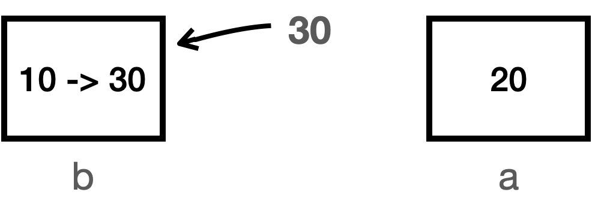

# 기본형 vs 참조형 2 - 변수 대입

## 1. 대원칙: 자바는 항상 변수의 값을 복사해서 대입한다

**대원칙:**
자바에서 변수에 값을 대입할 때는 **항상 “변수에 들어 있는 값”을 복사해서 대입**한다.

* **기본형(Primitive Type)**
  → 변수 안에 들어 있는 **실제 사용하는 값 자체**를 복사해서 대입한다.
* **참조형(Reference Type)**
  → 변수 안에 들어 있는 **참조값(객체가 있는 메모리 위치)** 을 복사해서 대입한다.

즉,

> 기본형이든 참조형이든, “변수에 들어 있는 값”을 그대로 복사해서 다른 변수에 넣는다.

이 원칙만 잘 이해하면, 뒤에서 보게 될 **참조형과 변수 대입**도 훨씬 단순하게 볼 수 있다.

---

## 2. 기본형과 변수 대입

### 2.1 기본형 대입 코드

```java
int a = 10;
int b = a;
```

* `a` 에는 값 `10`이 들어 있다.
* `b = a;` 는 **변수 `a`에 들어 있는 값 10을 복사해서 `b`에 넣는 것**이다.
  → 변수 `a` 자체를 `b`에 넣는 것이 아니다.

기본형은 **실제 사용하는 값이 변수에 바로 들어 있기 때문에**,
“값만 복사해서 대입한다”고 생각하면 이해하기 쉽다.

---

### 2.2 VarChange1 예제

기본형 대입을 조금 더 자세히 보기 위해 아래 예제를 보자.

```java
package ref;

public class VarChange1 {
    public static void main(String[] args) {
        int a = 10;
        int b = a;

        System.out.println("a = " + a);
        System.out.println("b = " + b);

        // a 변경
        a = 20;
        System.out.println("변경 a = 20");
        System.out.println("a = " + a);
        System.out.println("b = " + b);

        // b 변경
        b = 30;
        System.out.println("변경 b = 30");
        System.out.println("a = " + a);
        System.out.println("b = " + b);
    }
}
```

#### 실행 결과

```text
a = 10
b = 10
변경 a = 20
a = 20
b = 10
변경 b = 30
a = 20
b = 30
```

---

### 2.3 단계별로 살펴보기

#### 1) 초기 대입

- `int a = 10;`


- `int b = a;`


```text
a = 10
b = 10
```

* 변수의 대입은 **변수에 들어 있는 값을 복사**해서 대입한다.
* 여기서는 변수 `a` 에 들어 있는 값 `10`을 복사해서 변수 `b`에 넣은 것이다.
* **변수 `a` 자체를 `b`에 대입한 것이 아니다!**

---

#### 2) `a = 20` 으로 변경


```java
a = 20;
System.out.println("a = " + a);
System.out.println("b = " + b);
```

```text
a = 20
b = 10
```

* 변수 `a` 에 값 `20`을 새로 대입했다.
  → 그래서 `a`의 값이 `10`에서 `20`으로 변경되었다.
* 이때 **변수 `b`에는 아무런 변화가 없다.**
  여전히 `b`에는 `10`이 들어 있다.

---

#### 3) `b = 30` 으로 변경



```java
b = 30;
System.out.println("a = " + a);
System.out.println("b = " + b);
```

```text
a = 20
b = 30
```

* 변수 `b` 에 값 `30`을 대입하면,
  `b`의 값이 `10`에서 `30`으로 변경된다.
* 이때도 **변수 `a`에는 전혀 영향이 없다.**

---

### 2.4 최종 정리


여기서 가장 중요한 부분은 다음 코드다.

```java
int b = a;
```

* 이 코드는 **변수 `a`에 들어 있는 값을 복사해서 변수 `b`에 전달**한다는 뜻이다.
* 그래서 이후에 `a = 20`, `b = 30` 으로 각각 값을 변경해도,
  **각 변수는 자기 값만 바뀌고 서로에게 영향을 주지 않는다.**

> “너무 당연한 이야기 아닌가?” 라고 느껴질 수 있지만,
> 이 내용을 확실히 이해해 두어야 **다음에 나오는 ‘참조형과 변수 대입’에서 헷갈리지 않는다.**

---

## 3. 참조형과 변수 대입

이번에는 **참조형**에서 변수 대입이 어떻게 동작하는지 살펴보자.

### 3.1 Data 클래스 정의

참조형 예제를 위해 아주 단순한 클래스를 하나 만든다.
이 클래스는 `int value` 라는 멤버 변수 하나만 가진다.

```java
package ref;

public class Data {
    int value;
}
```

* `Data`는 클래스이므로 **참조형 타입**이다.
* 이 타입으로 만든 변수는 **`Data` 객체의 참조값(주소)** 를 저장하게 된다.

---

### 3.2 VarChange2 예제 코드

아래 코드를 보고, 먼저 어떤 결과가 나올지 직접 생각해 보는 것이 좋다.
그다음 실제 실행 결과를 비교해 보자.

```java
package ref;

public class VarChange2 {
    public static void main(String[] args) {
        Data dataA = new Data();
        dataA.value = 10;

        Data dataB = dataA;

        System.out.println("dataA 참조값=" + dataA);
        System.out.println("dataB 참조값=" + dataB);
        System.out.println("dataA.value = " + dataA.value);
        System.out.println("dataB.value = " + dataB.value);

        // dataA 변경
        dataA.value = 20;
        System.out.println("변경 dataA.value = 20");
        System.out.println("dataA.value = " + dataA.value);
        System.out.println("dataB.value = " + dataB.value);

        // dataB 변경
        dataB.value = 30;
        System.out.println("변경 dataB.value = 30");
        System.out.println("dataA.value = " + dataA.value);
        System.out.println("dataB.value = " + dataB.value);
    }
}
```

---

### 3.3 실행 결과

```text
dataA 참조값=ref.Data@x001
dataB 참조값=ref.Data@x001
dataA.value = 10
dataB.value = 10
변경 dataA.value = 20
dataA.value = 20
dataB.value = 20
변경 dataB.value = 30
dataA.value = 30
dataB.value = 30
```

---

### 3.4 단계별로 살펴보기

#### 1) Data 객체 생성 및 초기값 설정


```java
Data dataA = new Data();
dataA.value = 10;
```

* `dataA` 변수는 `Data` 클래스를 통해 만들었기 때문에 **참조형 변수**다.
* 이 변수는 `Data` 타입 객체의 **참조값(주소)** 를 저장한다.
* `new Data()` 로 `Data` 객체를 하나 생성하고, 그 **참조값을 `dataA`에 저장**한다.
* 그리고 그 객체의 `value` 변수에 값 `10`을 저장한다.

---

#### 2) `Data dataB = dataA` 대입


관련 코드:

```java
Data dataB = dataA;

System.out.println("dataA 참조값=" + dataA);
System.out.println("dataB 참조값=" + dataB);
System.out.println("dataA.value = " + dataA.value);
System.out.println("dataB.value = " + dataB.value);
```

출력:

```text
dataA 참조값=ref.Data@x001
dataB 참조값=ref.Data@x001
dataA.value = 10
dataB.value = 10
```

여기서도 **변수의 대입은 변수에 들어 있는 값을 복사해서 대입**한다.

* 변수 `dataA` 에는 참조값 `x001`이 들어 있다고 가정하자.
* `Data dataB = dataA;` 는
  → 변수 `dataA` 안에 들어 있던 **참조값 `x001`을 그대로 복사해서 `dataB`에 넣는다.**

> 참고:
> **변수 `dataA`가 가리키는 인스턴스(객체) 자체를 복사하는 것이 아니다!**
> 변수에 들어 있는 **참조값만** 복사해서 전달하는 것이다.

따라서,

* 이제 `dataA`와 `dataB`에 들어 있는 참조값은 같다.
* 둘 다 같은 `x001` `Data` 인스턴스를 가리킨다.

---

#### 3) `dataA.value = 20` 변경


```java
dataA.value = 20;
System.out.println("dataA.value = " + dataA.value);
System.out.println("dataB.value = " + dataB.value);
```

출력:

```text
dataA.value = 20
dataB.value = 20
```

* `dataA.value = 20;` 코드는
  → `dataA`가 가리키는 `x001` 인스턴스의 `value` 값을 `10`에서 `20`으로 변경한다.
* 그런데 `dataA`와 `dataB`는 **같은 `x001` 인스턴스를 참조**하고 있다.
* 그래서 `dataA.value` 와 `dataB.value` 는 **둘 다 20**이 출력된다.

---

#### 4) `dataB.value = 30` 변경


```java
dataB.value = 30;
System.out.println("dataA.value = " + dataA.value);
System.out.println("dataB.value = " + dataB.value);
```

출력:

```text
dataA.value = 30
dataB.value = 30
```

* `dataB.value = 30;` 코드는
  → `dataB`가 가리키는 **같은 `x001` 인스턴스**의 `value` 값을 `20`에서 `30`으로 변경한다.
* `dataA`와 `dataB`는 여전히 같은 인스턴스를 참조하고 있으므로,
  `dataA.value` 와 `dataB.value` 는 **둘 다 30**이 출력된다.

---

### 3.5 최종 정리

여기서 핵심은 다음 코드다.

```java
Data dataB = dataA;
```

* 이 코드는 변수에 들어 있는 **값(여기서는 참조값)** 을 복사해서 사용한다.
* 그 “값”이 **참조값**이기 때문에,
  `dataA`와 `dataB`는 **같은 참조값을 가지게 되고**,
  두 변수는 **같은 객체 인스턴스**를 참조하게 된다.
