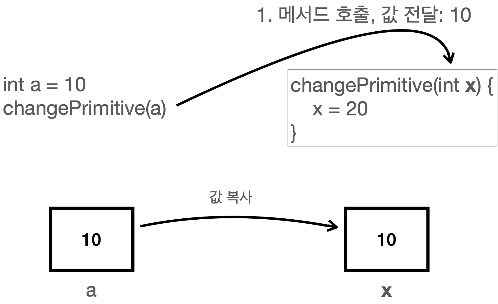
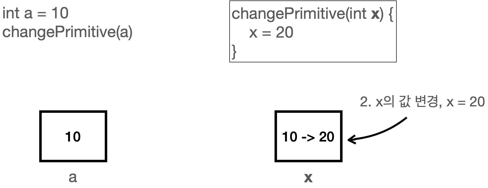
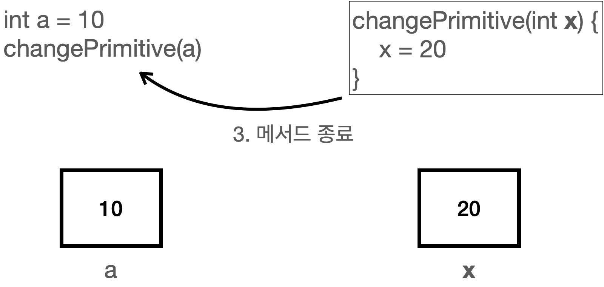
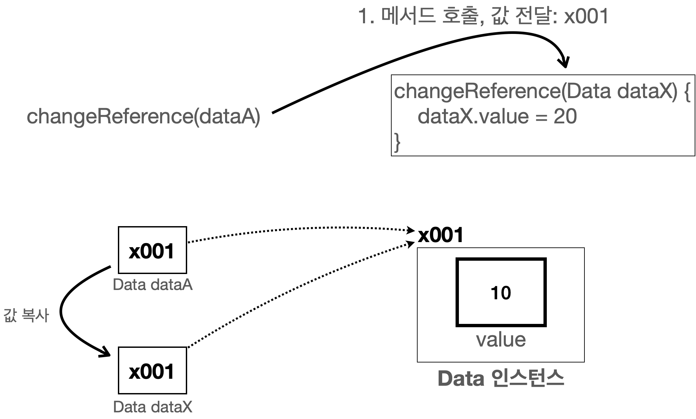
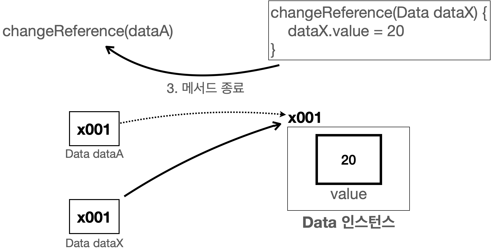

# 기본형 vs 참조형 3 - 메서드 호출

이번에는 **기본형과 참조형이 메서드 호출에서 어떻게 다르게 동작하는지**를 살펴본다.

---

## 1. 메서드 호출과 값 복사(대원칙)

**대원칙:**
자바는 항상 **변수에 들어 있는 값을 복사해서 대입**한다.

* **기본형**

    * 변수 안에 **실제 사용하는 값**이 들어 있다.
    * 대입 시, 이 값을 그대로 복사해서 새 변수에 넣는다.
* **참조형**

    * 변수 안에 **객체가 있는 메모리 위치(참조값)** 이 들어 있다.
    * 대입 시, 이 참조값을 복사해서 새 변수에 넣는다.

메서드 호출도 똑같다.
메서드를 호출할 때 사용하는 **매개변수(파라미터)** 도 결국 **변수**이기 때문에,
메서드에 값을 넘기는 것 역시 **값을 복사해서 전달**하는 것이다.

---

## 2. 기본형과 메서드 호출

먼저 기본형을 메서드에 전달했을 때 어떻게 동작하는지 본다.

### 2.1 예제 코드: `MethodChange1`

```java
package ref;

public class MethodChange1 {
    public static void main(String[] args) {
        int a = 10;
        System.out.println("메서드 호출 전: a = " + a);

        changePrimitive(a);

        System.out.println("메서드 호출 후: a = " + a);
    }

    static void changePrimitive(int x) {
        x = 20;
    }
}
```

### 2.2 실행 결과

```text
메서드 호출 전: a = 10
메서드 호출 후: a = 10
```

---

### 2.3 동작 단계

#### 1) 메서드 호출 – 값 복사



메서드를 호출할 때 매개변수 `x`에 변수 `a`의 값을 전달한다.
이 코드는 다음처럼 볼 수 있다.

```java
int x = a;
```

자바에서 변수에 값을 대입하는 것은 항상 값을 복사해서 대입한다.
따라서 변수 `a`, `x` 각각 **숫자 10을 가진다.**

---

#### 2) 메서드 안에서 값을 변경



메서드 안에서 다음 코드를 실행한다.

```java
x = 20;
```

이때 **변경되는 것은 `x`의 값뿐**이다.
결과적으로 `x`의 값만 `20`으로 바뀌고, `a`의 값은 여전히 `10`으로 유지된다.

---

#### 3) 메서드 종료



메서드가 종료된 후에 다시 확인해 보면, `a`는 `10`이 출력된다.
또한 메서드가 끝나면 매개변수 `x`는 **제거**된다.

---

## 3. 참조형과 메서드 호출

이번에는 **참조형 변수**를 메서드에 넘겼을 때의 동작을 살펴본다.

### 3.1 예제 코드: `MethodChange2`

```java
package ref;

public class MethodChange2 {
    public static void main(String[] args) {
        Data dataA = new Data();
        dataA.value = 10;

        System.out.println("메서드 호출 전: dataA.value = " + dataA.value);

        changeReference(dataA);

        System.out.println("메서드 호출 후: dataA.value = " + dataA.value);
    }

    static void changeReference(Data dataX) {
        dataX.value = 20;
    }
}
```

### 3.2 실행 결과

```text
메서드 호출 전: dataA.value = 10
메서드 호출 후: dataA.value = 20
```

---

### 3.3 초기 상태


먼저 `Data` 인스턴스를 생성하고, 그 **참조값을 `dataA` 변수에 저장**한 뒤,
그 인스턴스의 `value` 에 숫자 `10`을 넣은 상태는 아래와 같다.

---

### 3.4 동작 단계

#### 1) 메서드 호출 – 참조값 복사



메서드를 호출할 때 매개변수 `dataX` 에 변수 `dataA` 의 값을 전달한다.
이 코드는 다음처럼 해석할 수 있다.

```java
Data dataX = dataA;
```

자바는 변수에 값을 대입할 때 항상 값을 복사해서 대입한다.
변수 `dataA` 는 참조값 `x001`을 가지고 있으므로,
**이 참조값을 그대로 복사해서 `dataX`에 전달**한다.

그래서 변수 `dataA`, `dataX`는 **둘 다 같은 참조값 `x001`** 을 가지게 된다.
이제 `dataX`를 통해서도 `x001` 위치의 `Data` 인스턴스에 접근할 수 있다.

---

#### 2) 메서드 안에서 값을 변경


메서드 내부 코드:

```java
dataX.value = 20;
```

`dataX`가 가진 참조값을 통해 `x001` 인스턴스에 접근하고,
그 안에 있는 `value` 값을 `10`에서 `20`으로 변경한다.

`dataA`, `dataX`는 **같은 `x001` 인스턴스를 참조**하므로
`dataA.value` 와 `dataX.value` 는 **둘 다 20이라는 값을 갖게 된다.**

---

#### 3) 메서드 종료



메서드가 종료된 후 `dataA.value`를 확인해 보면, 값이 `20`으로 변경되어 있다.

```text
메서드 호출 전: dataA.value = 10
메서드 호출 후: dataA.value = 20
```

---

## 4. 기본형과 참조형의 메서드 호출 정리

자바에서 **메서드의 매개변수(파라미터)는 항상 “값에 의해” 전달**된다.
다만, 이때 전달되는 “값”이 무엇이냐에 따라 동작이 달라진다.

* **기본형**

    * 메서드로 **기본형 데이터를 전달하면, 해당 값(숫자 등)이 복사되어 전달**된다.
    * 메서드 내부에서 매개변수의 값을 변경해도 **호출한 쪽의 변수 값은 바뀌지 않는다.**
* **참조형**

    * 메서드로 **참조형 데이터를 전달하면, 참조값(메모리 주소)이 복사되어 전달**된다.
    * 메서드 내부에서 매개변수로 전달된 **객체의 멤버 변수 값을 변경하면**,
      그 객체를 공유하는 **호출자의 객체 상태도 함께 변경**된다.
