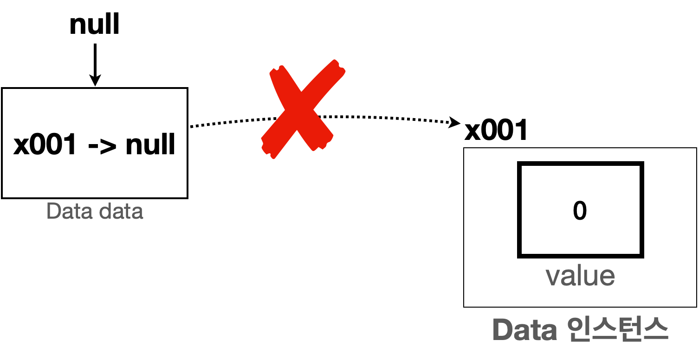

# null

## 1. null 이란?

택배를 보낼 때, **제품은 준비되었지만 받을 사람의 주소지가 아직 정해지지 않은 상태**일 수 있다.
이 경우 주소가 정해질 때까지 **주소 칸을 비워두어야** 한다.

참조형 변수에는 항상 **객체가 있는 메모리 위치(참조값)** 이 들어간다.
그런데,

* 아직 가리킬 대상이 없거나
* 가리킬 대상을 나중에 정하고 싶을 때

는 어떻게 해야 할까?

이럴 때 참조형 변수에 **`null`** 이라는 **특별한 값**을 넣어 둘 수 있다.

> `null` : 값이 **존재하지 않는다, 가리키는 대상이 없다**는 뜻의 값

---

## 2. null 값 할당 예제

### 2.1 Data 클래스

```java
package ref;

public class Data {
    int value;
}
```

앞서 만들었던 `Data` 클래스이며, 그대로 사용한다.

---

### 2.2 NullMain1 예제

```java
package ref;

public class NullMain1 {
    public static void main(String[] args) {
        Data data = null;
        System.out.println("1. data = " + data);

        data = new Data();
        System.out.println("2. data = " + data);

        data = null;
        System.out.println("3. data = " + data);
    }
}
```

#### 실행 결과

```text
1. data = null
2. data = ref.Data@x001
3. data = null
```

---

## 3. 코드 해석

### 3.1 `Data data = null;`


* `Data` 타입을 받을 수 있는 **참조형 변수 `data`** 를 만들었다.
* 여기에 `null` 값을 할당했다.
* 따라서 `data` 변수는 **아직 가리키는 객체가 없다**는 뜻이 된다.

---

### 3.2 `data = new Data();`


* 이후에 `new Data()` 로 **새로운 `Data` 객체를 생성**하고,
* 그 **참조값을 `data` 변수에 할당**했다.
* 이제 `data` 변수가 **참조할 객체가 존재**하게 된다.

---

### 3.3 `data = null;`



* 마지막으로 `data` 에 다시 `null` 값을 할당했다.
* 이렇게 하면 `data` 변수는 **앞서 만든 `Data` 인스턴스를 더 이상 참조하지 않는다.**

---

## 4. GC - 아무도 참조하지 않는 인스턴스의 최후


`data` 에 `null` 을 할당하면, 앞서 생성한 `x001` `Data` 인스턴스를
**더 이상 어떤 변수도 참조하지 않게 된다.**

* 이렇게 되면 `x001` 이라는 참조값을 다시 얻을 방법이 없다.
* 즉, 해당 인스턴스에 **다시 접근할 수 있는 방법이 완전히 사라진다.**
* 이런 인스턴스는 사용되지 않으면서 **메모리 용량만 차지**하게 된다.

과거의 C 같은 언어에서는 개발자가 직접 명령어를 사용해
인스턴스를 메모리에서 제거해야 했다.
만약 실수로 인스턴스 삭제를 빼먹으면,
사용하지 않는 객체가 메모리에 계속 쌓여서 **메모리 부족 오류**가 발생할 수 있다.

자바는 이런 과정을 **자동으로 처리**해 준다.

* 아무도 참조하지 않는 인스턴스가 생기면,
* JVM 의 **GC(가비지 컬렉션)** 이 그것을 **더 이상 사용하지 않는 인스턴스**라고 판단하고
* 해당 인스턴스를 **자동으로 메모리에서 제거**한다.

정리하면,

* 객체를 참조하는 곳이 하나라도 있으면, 그 객체는 **JVM 이 종료할 때까지 생존**할 수 있다.
* 하지만 중간에 그 객체를 참조하는 모든 곳이 사라지면,
  JVM 은 그것을 **필요 없는 객체**로 판단하고
  **GC(가비지 컬렉션)** 을 통해 제거한다.
